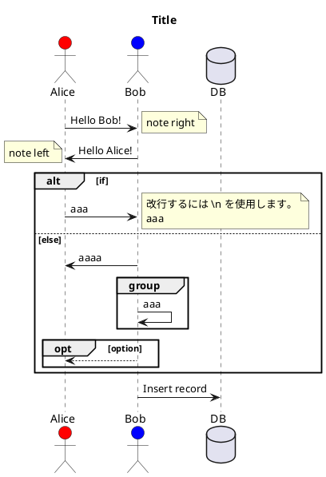

# シーケンス図

## 概要
PlantUML を用いたシーケンス図。

## 環境
GitHub でシーケンス図を表示するためには Chrome 拡張機能の [Pegmatite](https://chrome.google.com/webstore/search/Pegmatite) をインストールする必要があります。

```puml
@startuml
' 1行コメント
/'
    ブロックコメント
'/

title Title

actor Alice #red
actor Bob #blue
database DB

Alice -> Bob:Hello Bob!
note right: note right 
Bob -> Alice: Hello Alice!
note left: note left

alt if 
    Alice -> Bob: aaa
    note right: 改行するには \\n を使用します。\naaa
else else 
    Bob -> Alice: aaaa
    group group
        Bob -> Bob: aaa
    end

    opt option 
        Bob --> Alice
    end
end

Bob -> DB: Insert record 

@enduml
```